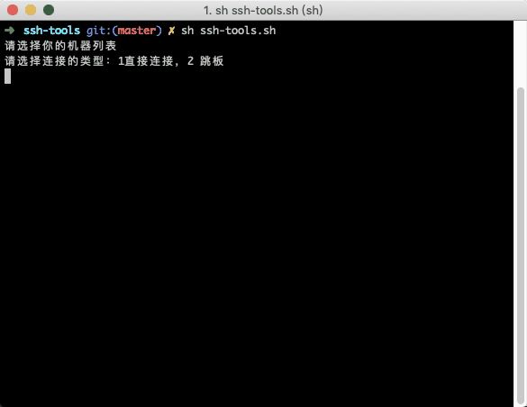
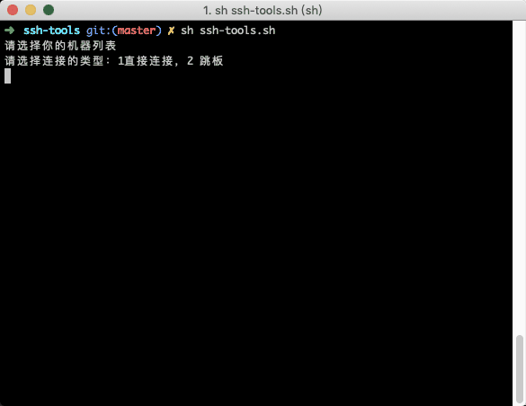

# ssh-tools

[]()[](<https://github.com/lonecloud/ssh-tools/releases>)[](https://www.apache.org/licenses/LICENSE-2.0.html)

> 一款为方便mac以及类unix使用ssh以及ssh跳板机的一个shell小工具

使用说明：

1. 克隆或者下载该项目

```bash
git clone git@github.com:lonecloud/ssh-tools.git
```

2. 配置ssh.dat

说明一下这几个的参数

1. 机器类型范围值：0 直接连接机器，1. 跳板机  2.目标机
2. ssh中的用户名以及IP(设置端口，非必填)： eg:username@ip [:port]
3. 密码
4. 备注，非必填选项

```bash
0 root@192.168.209.10:2315 123456 这个是直连机器
1 root@192.168.209.11 123456 这个是跳板机器
2 root@192.168.209.12:223 123456 这个是通过跳板后的目标机器
0 root@192.168.209.13 123456
```

操作指引图片：(PS: 最近不翻墙图片还看不了？！)

直连：




跳板机：




iterm2配置：

⌘ + o 打开配置文件


设置好相应的信息即可


双击配置文件即可打开！


## 未待完续，欢迎Fork and star

github地址：https://github.com/lonecloud/ssh-tools

码云地址：https://gitee.com/lonecloud/ssh-tools


欢迎大家提出宝贵的意见以及建议，请大家在issue提出哈